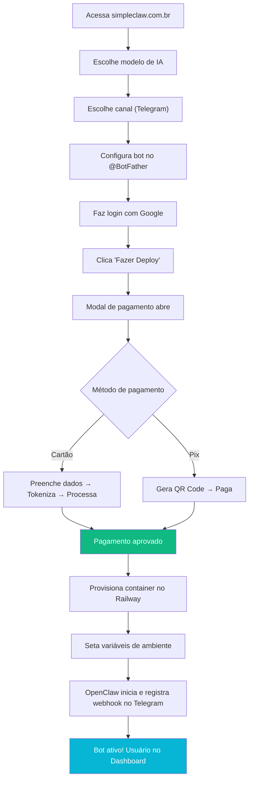
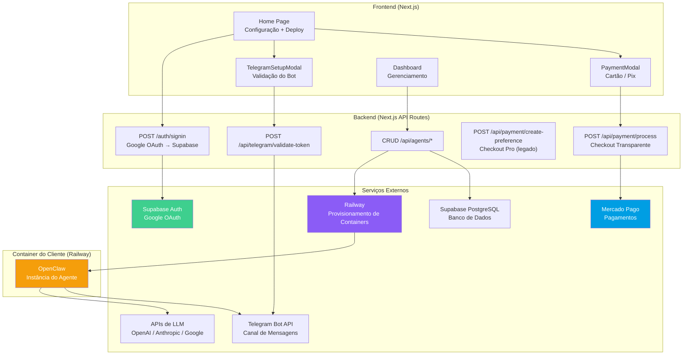
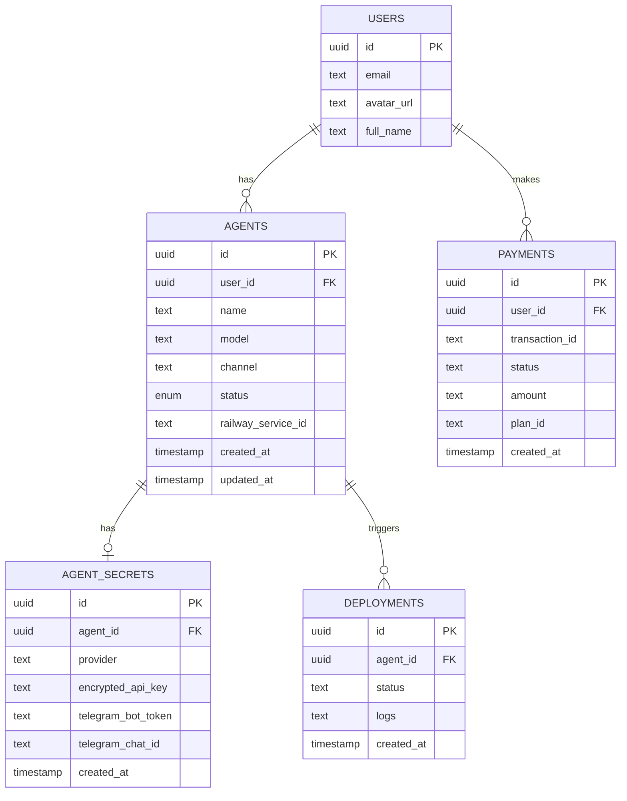
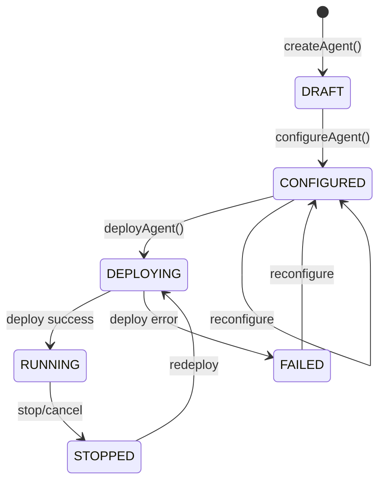
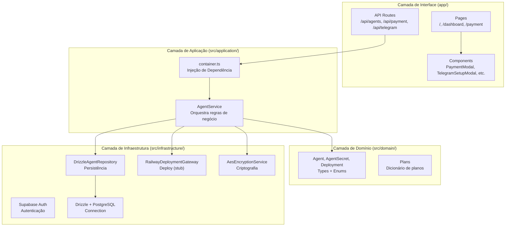

# 🇧🇷 SimpleClaw BR — Documentação Completa do Produto

> **"Vercel para OpenClaw"** — Deploy 1-click de agentes de IA com integração Telegram, sem terminal, sem DevOps.

---

## 1. Visão Geral do Produto

O SimpleClaw BR é uma plataforma SaaS que permite qualquer pessoa (inclusive não-técnica) implantar um agente de IA baseado no [OpenClaw](https://www.simpleclaw.com/) em menos de 1 minuto. O usuário escolhe o modelo de IA, conecta o Telegram, paga a assinatura, e a plataforma provisiona automaticamente um container na nuvem com o OpenClaw configurado e rodando.

### Proposta de Valor

| Para quem              | Problema atual                            | Solução BR-Claw               |
| ---------------------- | ----------------------------------------- | ----------------------------- |
| Devs iniciantes        | OpenClaw requer terminal, Docker, cloud   | Deploy 1-click, zero terminal |
| PMEs                   | Configurar servidor + bot + IA é complexo | Tudo guiado por interface     |
| Criadores de automação | Custo operacional alto                    | R$ 49,90/mês, tudo incluído   |

---

## 2. Fluxo Completo do Usuário



---

## 3. Arquitetura do Sistema

### 3.1. Visão de Alto Nível



### 3.2. Stack Tecnológico

| Camada             | Tecnologia                               | Propósito            |
| ------------------ | ---------------------------------------- | -------------------- |
| Frontend           | Next.js 15 (App Router) + TypeScript     | Interface do usuário |
| Estilo             | Tailwind CSS 4                           | Design system        |
| Auth               | Supabase Auth + Google OAuth             | Autenticação         |
| Banco de Dados     | Supabase PostgreSQL + Drizzle ORM        | Persistência         |
| Pagamentos         | Mercado Pago (MercadoPago.js + SDK Node) | Cobrança             |
| Infra (containers) | Railway (GraphQL API)                    | Provisionamento      |
| Criptografia       | AES-256-GCM (Node.js crypto)             | Secrets dos agentes  |
| Testes             | Vitest                                   | Testes unitários     |

---

## 4. Modelo de Dados



### Status do Agente (Máquina de Estados)



---

## 5. Integrações — Detalhamento

### 5.1. Supabase Auth (Google OAuth)

**Status: ✅ Implementado**

```
Fluxo:
1. Usuário clica "Login com Google" → @react-oauth/google
2. Frontend envia credential token → POST /auth/signin
3. Backend troca token Google → Supabase Auth (signInWithIdToken)
4. Supabase retorna session → salva nos cookies via @supabase/ssr
5. Middleware (middleware.ts) valida session em todas as rotas
6. Rotas protegidas (/dashboard) redirecionam se sem sessão
```

**Arquivos envolvidos:**

- `app/page.tsx` → componente GoogleLogin
- `app/auth/signin/route.ts` → POST handler
- `src/infrastructure/auth/supabase-client.ts` → client browser
- `src/infrastructure/auth/supabase.ts` → client server
- `middleware.ts` → validação de sessão

---

### 5.2. Telegram Bot API

**Status: ✅ Implementado (validação do token) | ⬜ Pendente (webhook)**

**O que já funciona:**

```
1. Usuário abre TelegramSetupModal
2. Segue guia passo-a-passo para criar bot no @BotFather
3. Cola o token no input
4. Frontend chama POST /api/telegram/validate-token
5. Backend chama api.telegram.org/bot{token}/getMe
6. Se válido: retorna nome + username do bot
7. Token é salvo no localStorage (temporário, para o flow de onboarding)
```

**O que falta (pós-pagamento):**

```
1. Token precisa ser persistido no banco (tabela agent_secrets, encriptado)
2. OpenClaw precisa receber o token como variável de ambiente
3. OpenClaw ao iniciar chama setWebhook() para registrar URL do container
4. Telegram começa a enviar mensagens para o container via POST /webhook
```

**Arquivo envolvido:**

- `components/TelegramSetupModal.tsx` → UI (guia + validação)
- `app/api/telegram/validate-token/route.ts` → validação server-side

---

### 5.3. Mercado Pago (Pagamentos)

**Status: ✅ Implementado (checkout transparente) | ⚠️ Checkout Pro existe mas será deprecated**

#### Checkout Transparente (Atual)

```
Fluxo Cartão:
1. Usuário preenche dados no PaymentModal (step 2)
2. MercadoPago.js tokeniza o cartão (PCI compliant)
    - createCardToken() → retorna token
    - getInstallments({ bin }) → retorna issuer_id + payment_method_id
3. Frontend envia token + dados → POST /api/payment/process
4. Backend resolve preço via planId (segurança: valor NUNCA vem do frontend)
5. Backend chama MercadoPago Payment.create() com o token
6. Resultado: approved | in_process | rejected
7. Salva na tabela payments (non-blocking)
8. Redireciona para /dashboard?payment=success

Fluxo Pix:
1. Usuário preenche email + CPF no PaymentModal
2. Frontend envia payment_method_id: "pix" → POST /api/payment/process
3. Backend chama MercadoPago Payment.create() com método pix
4. Resultado inclui point_of_interaction.transaction_data
5. Frontend exibe QR Code (base64) + código copia-e-cola
6. Após pagamento confirmado: redireciona
```

**Segurança implementada:**

- Preço resolvido server-side via `getPlanById()` — previne tampering
- Cartão tokenizado via MercadoPago.js — dados brutos nunca tocam nosso servidor
- DB insert non-blocking — falha no banco não quebra o pagamento

**Arquivos envolvidos:**

- `components/PaymentModal.tsx` → UI dois passos (plano → formulário)
- `app/api/payment/process/route.ts` → processamento card + pix
- `app/api/payment/create-preference/route.ts` → Checkout Pro (legado, pode ser removido)
- `src/domain/payment/plans.ts` → dicionário de planos server-side

**⬜ Pendente:**

- Webhook do Mercado Pago para confirmação assíncrona (Pix)
- Tabela `subscriptions` para gerenciar ciclo de vida da assinatura
- Renovação automática / cancelamento

---

### 5.4. Railway (Provisionamento)

**Status: ⬜ STUB — Não implementado (ponto crítico)**

O `RailwayDeploymentGateway` existe como **stub** que retorna dados falsos. A integração real com a API GraphQL do Railway precisa ser implementada.

#### O que o Gateway precisa fazer:

```
1. projectCreate     → Cria projeto isolado para o cliente
2. serviceCreate     → Cria serviço dentro do projeto (imagem Docker do OpenClaw)
3. variableUpsert    → Injeta variáveis de ambiente:
                        - DEFAULT_MODEL (ex: "claude-3.5-sonnet")
                        - MESSAGING_CHANNEL=telegram
                        - PROVIDER_API_KEY (chave descriptografada)
                        - TELEGRAM_BOT_TOKEN (descriptografado)
                        - TELEGRAM_CHAT_ID (descriptografado)
4. deploymentCreate  → Inicia o container
5. Retorna serviceId + logs → salva no banco
```

#### API do Railway (GraphQL):

```graphql
# Criar projeto
mutation {
  projectCreate(input: { name: "openclaw-{userId}" }) {
    id
  }
}

# Criar serviço a partir de imagem Docker
mutation {
  serviceCreate(
    input: {
      projectId: "..."
      source: { image: "ghcr.io/openclaw/openclaw:latest" }
    }
  ) {
    id
  }
}

# Setar variáveis
mutation {
  variableUpsert(
    input: {
      projectId: "..."
      serviceId: "..."
      name: "TELEGRAM_BOT_TOKEN"
      value: "..."
    }
  )
}
```

**Pré-requisitos:**

- Conta Railway com billing configurado (sua conta paga todos os containers)
- `RAILWAY_API_TOKEN` com permissão de criar projetos
- `RAILWAY_PROJECT_ID` (ou criar projetos dinamicamente)
- Imagem Docker do OpenClaw publicada (GHCR, Docker Hub, etc.)

**Arquivos envolvidos:**

- `src/infrastructure/deploy/railway-deployment-gateway.ts` → stub atual
- `src/application/agent/contracts.ts` → interface `DeploymentGateway`
- `src/application/agent/service.ts` → `deployAgent()` que chama o gateway

---

### 5.5. APIs de LLM (OpenAI / Anthropic / Google)

**Status: ⬜ Não implementado (indireto — através do OpenClaw)**

O BR-Claw **não** se comunica diretamente com as APIs de LLM. O OpenClaw rodando no container do Railway é quem faz isso. O BR-Claw apenas:

1. Recebe a API key do cliente no setup (BYOK — Bring Your Own Key)
2. Encripta com AES-256-GCM e salva no banco (`agent_secrets`)
3. Na hora do deploy, descriptografa e injeta como variável de ambiente no container

**Modelos suportados:** Claude Opus 4.5, GPT-5.2, Gemini Flash

---

### 5.6. OpenClaw

**Status: ⬜ Não integrado — entidade externa**

O OpenClaw é o **produto que será deployado**, não faz parte do código do BR-Claw. É uma aplicação separada que:

1. Recebe mensagens via webhook do Telegram
2. Processa com o modelo de IA configurado
3. Responde de volta pelo Telegram

**O que precisamos do OpenClaw:**

- Imagem Docker publicada e acessível
- Documentação das variáveis de ambiente aceitas
- Confirmação de que suporta `setWebhook` automático ao iniciar

---

## 6. Arquitetura do Código (Clean Architecture)



**Princípios seguidos:**

- Interfaces (`contracts.ts`) separam domínio de infraestrutura
- `AgentService` depende de abstrações, não de implementações
- DI manual via `container.ts` (singleton)
- Secrets encriptados em repouso (AES-256-GCM)

---

## 7. API Routes — Contratos

### Agents

| Método | Rota                      | Descrição                               | Status  |
| ------ | ------------------------- | --------------------------------------- | ------- |
| `GET`  | `/api/agents`             | Lista agentes do usuário                | ✅      |
| `POST` | `/api/agents`             | Cria agente (DRAFT)                     | ✅      |
| `GET`  | `/api/agents/:id`         | Detalhes do agente                      | ✅      |
| `POST` | `/api/agents/:id/config`  | Configura secrets/canal (CONFIGURED)    | ✅      |
| `POST` | `/api/agents/:id/deploy`  | Deploy no Railway (DEPLOYING → RUNNING) | ⚠️ Stub |
| `GET`  | `/api/agents/:id/logs`    | Logs do último deployment               | ✅      |
| `POST` | `/api/agents/:id/restart` | Restart do serviço Railway              | ⚠️ Stub |

### Payment

| Método | Rota                             | Descrição                        | Status      |
| ------ | -------------------------------- | -------------------------------- | ----------- |
| `POST` | `/api/payment/process`           | Checkout transparente (card/pix) | ✅          |
| `POST` | `/api/payment/create-preference` | Checkout Pro (legado, redirect)  | ⚠️ Deprecar |
| `POST` | `/api/payment/webhook`           | Webhook do Mercado Pago          | ⬜ Pendente |

### Telegram

| Método | Rota                           | Descrição                 | Status |
| ------ | ------------------------------ | ------------------------- | ------ |
| `POST` | `/api/telegram/validate-token` | Valida token do BotFather | ✅     |

### Auth

| Método | Rota           | Descrição                 | Status |
| ------ | -------------- | ------------------------- | ------ |
| `POST` | `/auth/signin` | Google OAuth via Supabase | ✅     |

---

## 8. Comunicação entre Componentes

### 8.1. Frontend → Backend

| Quem chama           | Endpoint                            | Dados enviados                                           | Dados recebidos                          |
| -------------------- | ----------------------------------- | -------------------------------------------------------- | ---------------------------------------- |
| `PaymentModal`       | `POST /api/payment/process`         | `{ token, issuer_id, payment_method_id, planId, payer }` | `{ status, id, pixQrCode? }`             |
| `TelegramSetupModal` | `POST /api/telegram/validate-token` | `{ token }`                                              | `{ valid, bot: { id, username, name } }` |
| `HomePage`           | `POST /auth/signin`                 | `{ token }` (Google credential)                          | `{ user }`                               |
| `AgentDashboard`     | `POST /api/agents`                  | `{ name, model, channel }`                               | `{ agent }`                              |
| `AgentDashboard`     | `POST /api/agents/:id/config`       | `{ provider, apiKey, telegramBotToken, telegramChatId }` | `{ agent }`                              |
| `AgentDashboard`     | `POST /api/agents/:id/deploy`       | —                                                        | `{ deploymentId, agent }`                |

### 8.2. Backend → Serviços Externos

| Quem chama                  | Serviço             | Protocolo  | Dados                              |
| --------------------------- | ------------------- | ---------- | ---------------------------------- |
| `route.ts (process)`        | Mercado Pago        | REST (SDK) | Payment.create()                   |
| `route.ts (validate-token)` | Telegram Bot API    | REST       | GET /bot{token}/getMe              |
| `RailwayDeploymentGateway`  | Railway             | GraphQL    | projectCreate, serviceCreate, etc. |
| `DrizzleAgentRepository`    | Supabase PostgreSQL | TCP (pg)   | Queries SQL via Drizzle            |
| `middleware.ts`             | Supabase Auth       | REST       | getUser()                          |

### 8.3. Container OpenClaw → Externo

| Quem chama | Serviço                     | Protocolo  | Propósito                        |
| ---------- | --------------------------- | ---------- | -------------------------------- |
| OpenClaw   | Telegram Bot API            | REST       | setWebhook(), sendMessage()      |
| OpenClaw   | OpenAI / Anthropic / Google | REST       | Geração de respostas             |
| Telegram   | OpenClaw                    | HTTPS POST | Encaminha mensagens dos usuários |

---

## 9. O que está Construído vs. O que Falta

### ✅ Pronto

| Componente                      | Descrição                                                |
| ------------------------------- | -------------------------------------------------------- |
| Landing page                    | Seleção de modelo + canal + login                        |
| Google OAuth                    | Login via Supabase Auth                                  |
| Telegram Setup                  | Modal com guia + validação de token                      |
| Payment (Checkout Transparente) | Modal 2 etapas: plano → cartão/pix                       |
| DB Schema                       | 4 tabelas (agents, agent_secrets, deployments, payments) |
| Agent CRUD                      | Criar, listar, configurar, status                        |
| Clean Architecture              | Service, Repository, Gateway (interfaces)                |
| Criptografia                    | AES-256-GCM para secrets                                 |
| Dashboard (básico)              | Listagem de agentes, deploy, logs                        |

### ⬜ Pendente (Ordem de Prioridade)

| #   | Componente                         | Descrição                                                                                       | Complexidade |
| --- | ---------------------------------- | ----------------------------------------------------------------------------------------------- | ------------ |
| 1   | **Railway Gateway**                | Implementar a API GraphQL real (projectCreate, serviceCreate, variableUpsert, deploymentCreate) | 🔴 Alta      |
| 2   | **Imagem Docker do OpenClaw**      | Obter/criar imagem Docker deployável no Railway                                                 | 🔴 Alta      |
| 3   | **Webhook Mercado Pago**           | Receber confirmação assíncrona de Pix e atualizar status                                        | 🟡 Média     |
| 4   | **Conexão Pagamento → Deploy**     | Após pagamento aprovado, disparar provisionamento automaticamente                               | 🟡 Média     |
| 5   | **Tabela subscriptions**           | Gerenciar ciclo de vida: ativo, expirado, cancelado                                             | 🟡 Média     |
| 6   | **userId real**                    | Substituir mock por sessão Supabase nos endpoints de pagamento                                  | 🟢 Baixa     |
| 7   | **Persistir config do onboarding** | Salvar modelo + canal + token do Telegram no banco (atualmente fica no localStorage)            | 🟢 Baixa     |
| 8   | **Dashboard melhorado**            | Status real do container, URL do bot, métricas                                                  | 🟡 Média     |
| 9   | **Renovação/cancelamento**         | Cronjob ou webhook para parar containers de assinaturas expiradas                               | 🟡 Média     |
| 10  | **Remover Checkout Pro**           | Limpar o endpoint create-preference (legado)                                                    | 🟢 Baixa     |

---

## 10. Fluxo Técnico Completo (Ponta a Ponta)

### Cenário: Novo Usuário faz deploy pela primeira vez

```
[FRONTEND - app/page.tsx]
│
├─ 1. Seleciona modelo (claude-opus)          → salva localStorage
├─ 2. Seleciona canal (telegram)              → salva localStorage
├─ 3. Abre TelegramSetupModal
│     └─ Cola token → POST /api/telegram/validate-token
│        └─ Backend chama Telegram API getMe → retorna bot info
│     └─ Salva token + bot no localStorage
│
├─ 4. Faz login com Google
│     └─ POST /auth/signin → Supabase signInWithIdToken
│     └─ Seta isLoggedIn = true
│
├─ 5. Clica "Fazer Deploy"
│     └─ Abre PaymentModal (step: "plan")
│        └─ Mostra preço R$ 49,90/mês + features
│        └─ Clica "Pagar Agora" → step: "form"
│
│     ┌── TAB CARTÃO ────────────────────────────────┐
│     │ Preenche número → getInstallments(bin)        │
│     │ Preenche nome, validade, cvv, email, cpf      │
│     │ Clica "Pagar R$ 49,90"                        │
│     │   └─ createCardToken() → token                │
│     │   └─ POST /api/payment/process                │
│     │        └─ getPlanById("pro-monthly") → R$49,90│
│     │        └─ Payment.create({ token, ... })      │
│     │        └─ DB insert (non-blocking)            │
│     │        └─ Retorna { status: "approved" }      │
│     │   └─ Redireciona → /dashboard?payment=success │
│     └──────────────────────────────────────────────┘
│
│     ┌── TAB PIX ───────────────────────────────────┐
│     │ Preenche email, cpf                           │
│     │ Clica "Gerar QR Code Pix"                     │
│     │   └─ POST /api/payment/process                │
│     │        └─ Payment.create({ pix })             │
│     │        └─ Retorna QR code base64 + código     │
│     │   └─ Exibe QR Code para escaneio              │
│     │   └─ [PENDENTE] Webhook confirma pagamento    │
│     └──────────────────────────────────────────────┘
│
[PÓS-PAGAMENTO — PENDENTE DE IMPLEMENTAÇÃO]
│
├─ 6. [TODO] Cria agent no banco
│     └─ POST /api/agents { name, model, channel: "telegram" }
│     └─ Status: DRAFT
│
├─ 7. [TODO] Configura secrets
│     └─ POST /api/agents/:id/config { provider, apiKey, telegramBotToken, telegramChatId }
│     └─ Encripta secrets com AES-256-GCM
│     └─ Status: CONFIGURED
│
├─ 8. [TODO] Dispara deploy
│     └─ POST /api/agents/:id/deploy
│     └─ RailwayDeploymentGateway.deployAgent()
│        └─ Railway API: projectCreate → serviceCreate → variableUpsert → deploymentCreate
│     └─ Status: DEPLOYING → RUNNING
│
├─ 9. [TODO] OpenClaw inicia no container
│     └─ Lê variáveis de ambiente
│     └─ Chama Telegram setWebhook(https://openclaw-xxx.up.railway.app/webhook)
│     └─ Pronto para receber mensagens
│
└─ 10. Dashboard mostra agente RUNNING
       └─ Botão restart, ver logs, URL do bot
```

---

## 11. Segurança

| Aspecto      | Implementação                                  |
| ------------ | ---------------------------------------------- |
| Autenticação | Supabase Auth (Google OAuth) + session cookies |
| Autorização  | Middleware valida session em todas as rotas    |
| RLS          | Habilitado no banco (users veem só seus dados) |
| Secrets      | AES-256-GCM com chave derivada de APP_SECRET   |
| Pagamento    | Tokenização PCI via MercadoPago.js             |
| Preço        | Resolvido server-side (anti-tampering)         |
| Isolamento   | Cada cliente terá projeto Railway separado     |

---

## 12. Variáveis de Ambiente

### BR-Claw (sua aplicação)

```env
DATABASE_URL=postgresql://...
NEXT_PUBLIC_APP_URL=http://localhost:3000
APP_SECRET=chave-para-criptografia-aes

# Mercado Pago
MERCADO_PAGO_ACCESS_TOKEN=...
NEXT_PUBLIC_MERCADO_PAGO_PUBLIC_KEY=...

# Railway
RAILWAY_API_TOKEN=...
RAILWAY_PROJECT_ID=...

# Supabase
NEXT_PUBLIC_SUPABASE_URL=...
NEXT_PUBLIC_SUPABASE_ANON_KEY=...
```

### Container OpenClaw (injetadas pelo Railway)

```env
DEFAULT_MODEL=claude-3.5-sonnet
MESSAGING_CHANNEL=telegram
PROVIDER_API_KEY=sk-xxx...
TELEGRAM_BOT_TOKEN=123456789:ABCdef...
TELEGRAM_CHAT_ID=987654321
```

---

## 13. Modelo de Negócio

| Item                     | Valor                                    |
| ------------------------ | ---------------------------------------- |
| Preço da assinatura      | R$ 49,90/mês                             |
| Custo Railway (estimado) | ~$5-10/mês por container                 |
| Custo LLM                | R$ 0 (BYOK — cliente traz a própria key) |
| Margem                   | ~60-80% por cliente                      |

### Ciclo de Vida da Assinatura (a implementar)

```
Pagamento aprovado → subscription.status = "active"
                   → subscription.expires_at = +30 dias
                   → provisiona container Railway

30 dias depois → Mercado Pago renova automaticamente (webhook)
              → subscription.expires_at = +30 dias

Pagamento falha → subscription.status = "past_due"
               → grace period de 3 dias
               → container pausado no Railway

Cancelamento → subscription.status = "cancelled"
            → container deletado no Railway
```

---

## 14. Próximos Passos (Roadmap Técnico)

### Fase 1 — MVP Funcional

1. Implementar `RailwayDeploymentGateway` real
2. Obter/configurar imagem Docker do OpenClaw
3. Conectar pagamento aprovado → criação automática de agent + deploy
4. Persistir dados do onboarding no banco (sair do localStorage)
5. Webhook do Mercado Pago para Pix

### Fase 2 — Produção

6. Tabela `subscriptions` + lógica de renovação/cancelamento
7. Dashboard com status real do container (Railway API)
8. Logs em tempo real do container
9. Deploy em produção (Vercel + domínio)

### Fase 3 — Escala

10. Multi-agentes por usuário
11. WhatsApp + Discord
12. Templates de agentes
13. Marketplace
